# 19173025 임예현
Hello My name is YeHyeon

# 2주차 과제
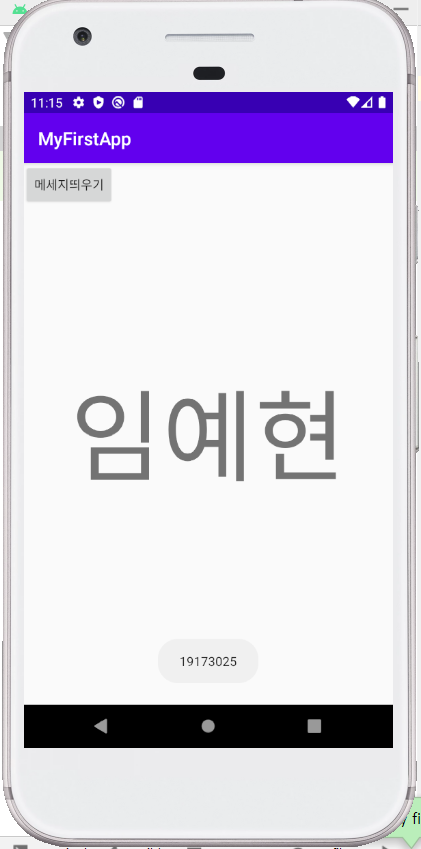</img>

# 3주차 과제
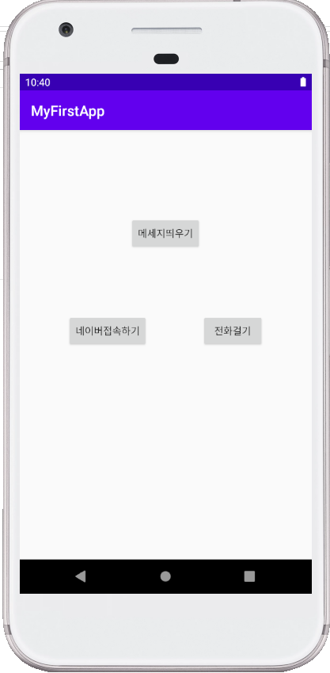</img>
</img>
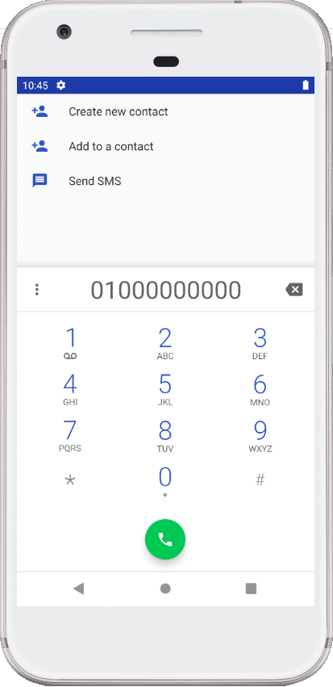</img>

# 4주차 과제
다이어트에 필요한 앱
- 체중계로 무게를 재면 앱에 기록이 된다. 
- 무게를 재면 자동으로 앱에 매일 체중이 기록되며, 손쉽게 체중 변화를 알 수 있다. 
- 하루하루 식단과 칼로리를 기록할 수 있으며, 운동량을 입력하면 칼로리 소모량이 계산되어 기록된다.
- 단 하나의 앱으로 몸무게의 변화, 하루 식단•칼로리, 운동량과 칼로리 소모량을 알 수 있다.

# 7주차 과제
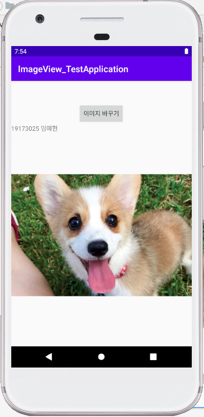</img>
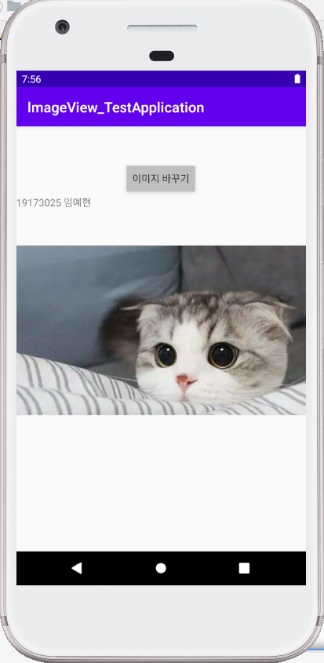</img>

# 9주차 과제
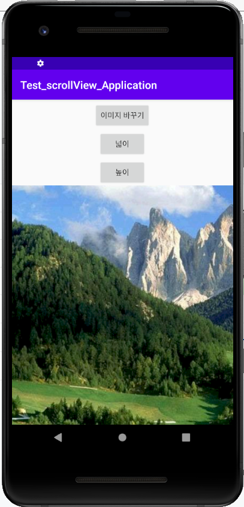</img>
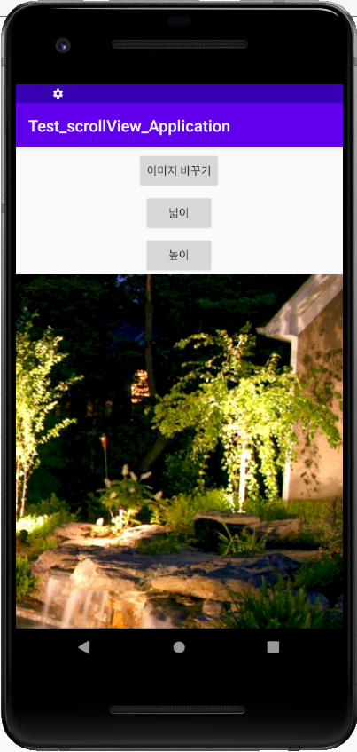</img>
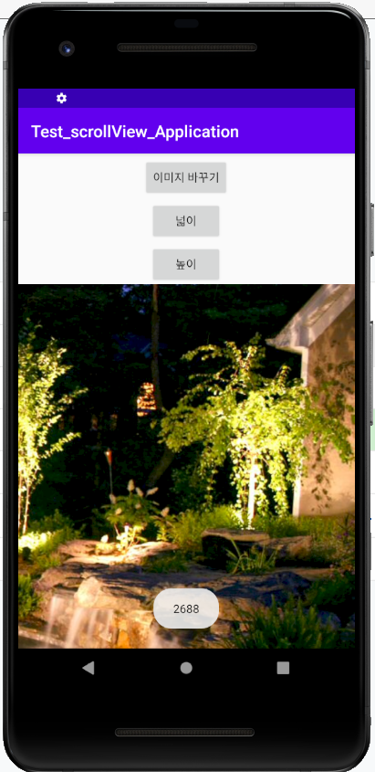</img>
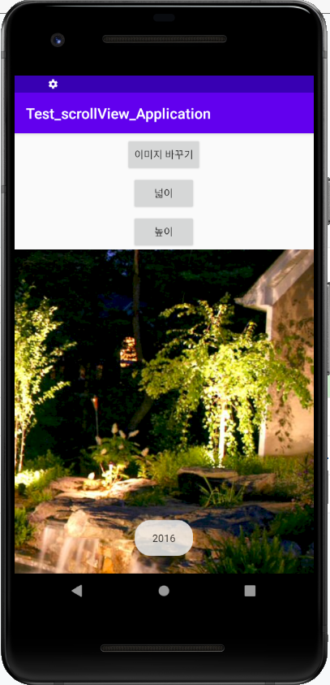</img>

# 10주차 과제
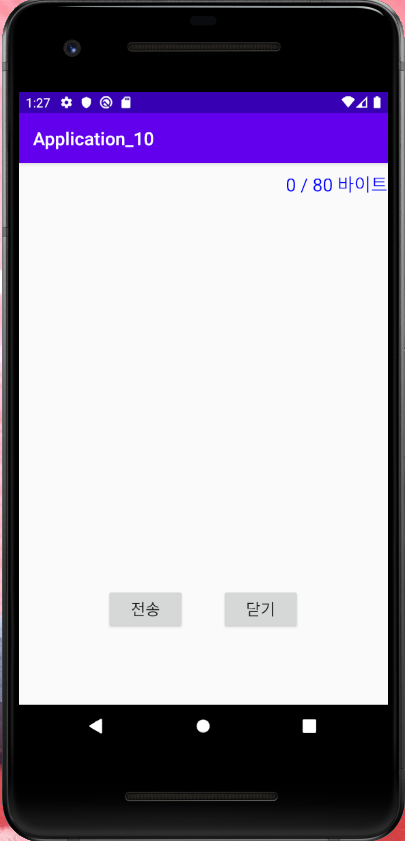</img>
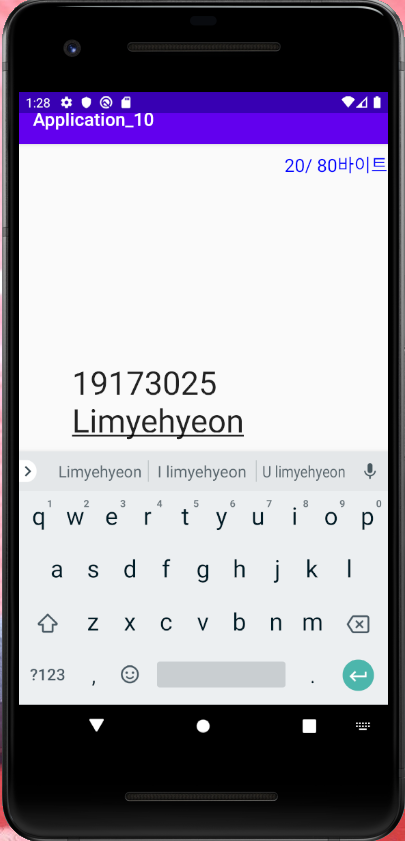</img>

# 11주차 과제
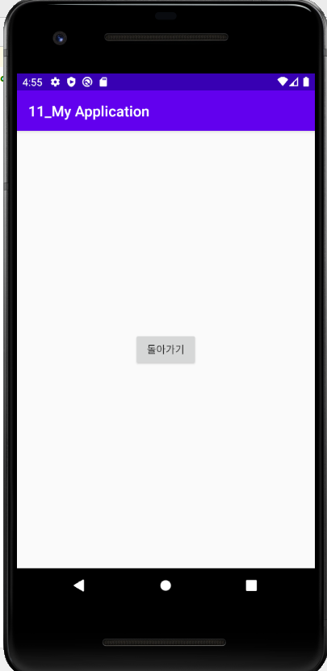</img>
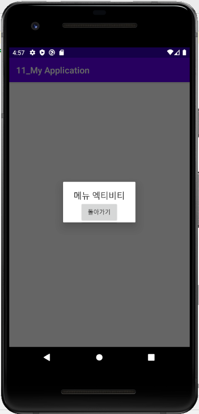</img>
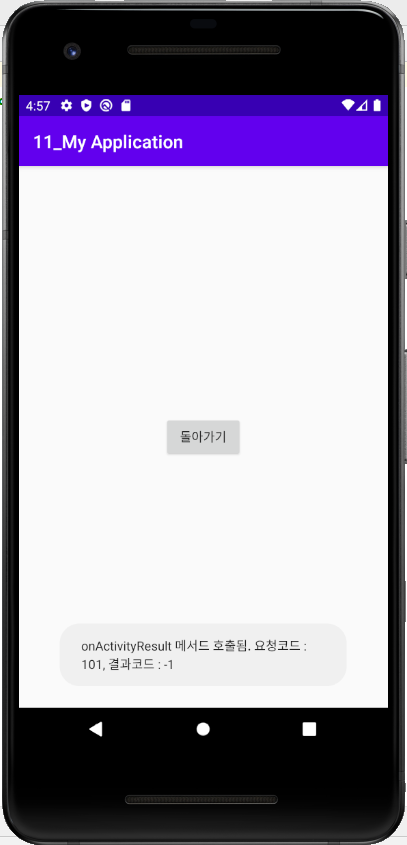</img>
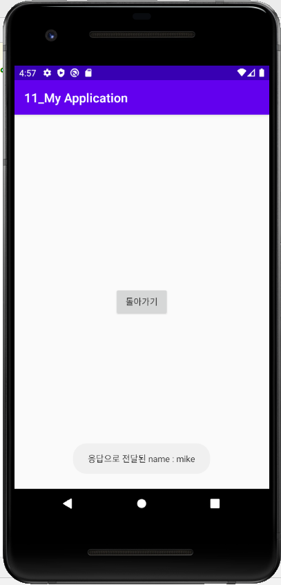</img>

# 12주차 과제
</img>
</img>
</img>

